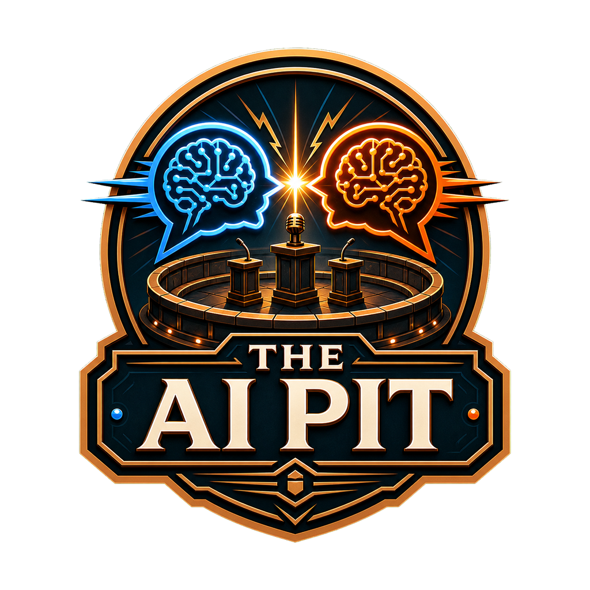
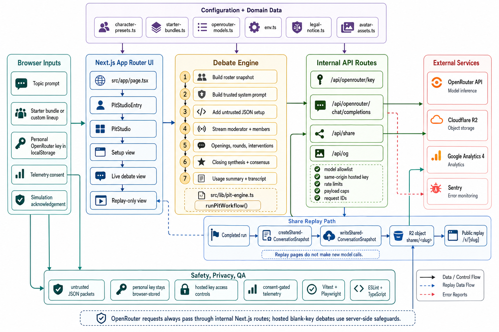

<div align="center">
  

  <h1>The AI Pit</h1>

  <p><strong>🔥 Where AI personas clash in moderator-led debates 🔥</strong></p>

  <p><a href="https://aipit.tsilva.eu">Live Demo</a> · <a href="https://github.com/tsilva/aipit">GitHub</a></p>
</div>

The AI Pit turns a topic into a structured debate with a moderator, multiple AI participants, opening statements, rounds, interventions, and a closing synthesis. It is built with Next.js, React, Tailwind CSS, and OpenRouter.

Use the preset characters and starter bundles to begin quickly, or build a custom lineup with your own participant profiles. Completed debates can be saved as replay links when Cloudflare R2 storage is configured.

## Install

Requires Node.js 20.9 or newer.

```bash
git clone https://github.com/tsilva/aipit.git
cd aipit
npm install
cp .env.example .env
npm run dev
```

Open [http://localhost:3000](http://localhost:3000).

You can paste a personal OpenRouter API key in the app. To allow blank-key hosted debates, set `OPENROUTER_API_KEY` in `.env`.

## Commands

```bash
npm run dev           # start the local Next.js dev server
npm run build         # generate avatar asset versions and build production output
npm run start         # serve the production build
npm run lint          # run ESLint
npm run typecheck     # run TypeScript checks
npm run test          # run Vitest tests
npm run test:e2e      # run Playwright tests
npm run sentry:issues # query Sentry issues with a read-only token
```

## Configuration

The app runs without a server OpenRouter key if users provide their own key in the browser.

```bash
NEXT_PUBLIC_SITE_URL=http://localhost:3000
NEXT_PUBLIC_OPENROUTER_APP_NAME=The AI Pit
OPENROUTER_API_KEY=
```

Optional production features use these variables:

```bash
NEXT_PUBLIC_GA_MEASUREMENT_ID= # Google Analytics 4
NEXT_PUBLIC_SENTRY_DSN=        # browser Sentry DSN
NEXT_PUBLIC_SENTRY_ENABLED=    # force Sentry outside production
SENTRY_DSN=                    # server Sentry DSN
SENTRY_AUTH_TOKEN=             # source map upload or read-only issue queries
SENTRY_ORG=                    # defaults to tsilva
SENTRY_PROJECT=                # defaults to aipit
SENTRY_BASE_URL=https://sentry.io

R2_ACCOUNT_ID=                 # required for share links
R2_BUCKET_NAME=                # required for share links
R2_ACCESS_KEY_ID=              # required for share links
R2_SECRET_ACCESS_KEY=          # required for share links
R2_OBJECT_PREFIX=shares/       # optional share snapshot prefix
```

`NEXT_PUBLIC_SITE_URL` should be set in production unless the deployment platform provides a canonical Vercel URL.

## Notes

- OpenRouter calls go through the internal Next.js routes under `src/app/api/openrouter`.
- Personal OpenRouter keys are stored in browser `localStorage` and still transit the app proxy so OpenRouter can fulfill requests.
- Hosted OpenRouter access uses same-origin checks, simple rate limits, model allowlisting, and payload caps.
- Share links are public-by-URL replay snapshots stored in Cloudflare R2. Replay pages do not make new model calls.
- Google Analytics and browser Sentry are optional and respect the app's telemetry consent controls.
- Avatar assets in `public/avatars` are served with long-lived cache headers and versioned by `scripts/generate-avatar-asset-versions.mjs`.
- The app is an experimental AI simulation, not an advice service or official communications channel.

## Architecture



## License

[MIT](LICENSE)
